# 📝 Relatório Técnico: Um Estudo das Características de Qualidade de Sistemas Java

## 1. Informações do grupo

- **🎓 Curso:** Engenharia de Software
- **📘 Disciplina:** Laboratório de Experimentação de Software
- **🗓 Período:** 6° Período
- **👨‍🏫 Professor(a):** Prof. Dr. João Paulo Carneiro Aramuni
- **👥 Membros do Grupo:** Ana Luiza Machado Alves, Lucas Henrique Chaves de Barros e Raquel Inez de Almeida Calazans

---

## 2. Introdução

Este projeto tem como objetivo analisar aspectos da qualidade interna de repositórios desenvolvidos em **Java**, correlacionando-os com características do seu processo de desenvolvimento.

A análise é realizada sob a perspectiva de métricas de produto, calculadas por meio da ferramenta **CK (Chidamber & Kemerer Java Metrics)**, contemplando atributos como:

- **Modularidade**
- **Manutenibilidade**
- **Legibilidade**

O estudo está inserido no contexto de sistemas **open-source**, onde múltiplos desenvolvedores colaboram em diferentes partes do código. Nessa abordagem, práticas como **revisão de código** e **análise estática** (via ferramentas de CI/CD) são fundamentais para mitigar riscos e preservar a qualidade do software.

### CK Metrics Extractor

Nesse projeto, utilizaremos o **CK Metrics Extractor** como ferramenta de coleta. O CK Tool é usado para análise de métricas de código-fonte Java, focando em aspectos de qualidade e complexidade. Ele automatiza a extração de métricas importantes para classes, métodos, campos e variáveis, auxiliando na avaliação e melhoria do projeto.

A ferramenta gera um arquivo `.csv` contendo as métricas extraídas de cada repositório Java analisado. Esse arquivo será utilizado para análises estatísticas, visualização de dados e comparação entre diferentes projetos, facilitando a identificação de padrões e tendências relacionadas à qualidade do código.

--- 

## 3. Tecnologias e ferramentas utilizadas

- **💻 Linguagem de Programação:** Python 3.x
- **🛠 Frameworks:** CK Tool, GraphQL
- **🌐 API utilizada:** GitHub GraphQL API, GitHub REST API
- **📦 Dependências/Bibliotecas:**
  - Python: pandas, matplotlib, seaborn, gitpython, requests, keyring, tqdm
  - Java 21
  - Maven

### 🚀 Preparação do Ambiente

**1. Clone este repositório:**

```bash
git clone https://github.com/analuizaalvesm/java-repos-ck-analyzer.git
cd java-repos-ck-analyzer
```

**2. (Opcional) Crie um ambiente virtual:**

```bash
 python3 -m venv .venv
 source .venv/bin/activate  # Linux/macOS
 .venv\Scripts\activate     # Windows
```

**2. Instale as dependências Python:**

```bash
pip install -r requirements.txt
```

**3. Baixe o [CK Tool](https://github.com/mauricioaniche/ck) (jar):**

```bash
cd code/
git clone https://github.com/mauricioaniche/ck.git
```

**4. Execute a coleta da análise:**

```bash
cd code/
python main.py          # coleta os repositórios
python ck_metrics.py    # roda a análise CK

cd utils/
python analyzer.py      # consolida as métricas de qualidade em uma tabela
python charts.py        # gera os gráficos
python metrics.py       # imprime métricas específicas das LMs (Lab Metrics)
```

_Observação: é necessário configurar uma chave de acesso pessoal (token) do GitHub nas variáveis de ambiente/keyring do seu sistema._

---

### 4. Questões de Pesquisa (Research Questions – RQs)

As questões de pesquisa (RQs) deste estudo buscam analisar a relação entre métricas de processo e métricas de qualidade de repositórios Java.

**🔍 Questões de Pesquisa - Research Questions (RQs):**

| RQ   | Pergunta                                                                                      |
| ---- | --------------------------------------------------------------------------------------------- |
| RQ01 | Qual a relação entre a **popularidade** dos repositórios e suas características de qualidade? |
| RQ02 | Qual a relação entre a **maturidade** dos repositórios e suas características de qualidade?   |
| RQ03 | Qual a relação entre a **atividade** dos repositórios e suas características de qualidade?    |
| RQ04 | Qual a relação entre o **tamanho** dos repositórios e suas características de qualidade?      |

### 4.1. Hipóteses Informais (Informal Hypotheses – IH)

As **Hipóteses Informais** foram elaboradas a partir das RQs, estabelecendo expectativas sobre os resultados esperados do estudo:

**💡 Hipóteses Informais - Informal Hypotheses (IH):**

| IH   | Descrição                                                                                                                                                                        |
| ---- | -------------------------------------------------------------------------------------------------------------------------------------------------------------------------------- |
| IH01 | Repositórios mais populares tendem a apresentar melhor legibilidade e modularidade, já que atraem mais colaboradores e passam por revisões frequentes.                           |
| IH02 | Projetos maduros, mantidos por mais tempo, possuem métricas de qualidade mais consistentes, refletindo evolução gradual e práticas consolidadas de desenvolvimento.              |
| IH03 | Repositórios com maior atividade (commits e pull requests frequentes) apresentam maior manutenibilidade, uma vez que o código é constantemente atualizado e ajustado.            |
| IH04 | Repositórios maiores tendem a apresentar desafios na manutenção e modularidade, já que o aumento de tamanho pode impactar negativamente a simplicidade e legibilidade do código. |

---

## 5. Metodologia

O experimento foi conduzido em cinco etapas principais: **coleta de dados**, **extração de métricas de processo e de qualidade**, **sumarização**, **análise dos dados** e **visualização dos resultados**.

---

### 5.1 Coleta de dados

- Foram considerados **top 1000 repositórios em Java**, selecionados a partir dos seguintes critérios:
  - **Popularidade** → ex.: repositórios com maior número de estrelas (top-N).
  - **Linguagem primária** → restrição a Java como linguagem específica.
  - **Atividade mínima** → presença de commits, issues ou releases nos últimos anos.
- O script utiliza a **GraphQL API** do GitHub, que permite buscar dados estruturados e específicos de repositórios em uma única requisição.
- Definição da `query`:
  - Nome, dono, URL
  - Número de estrelas (stargazerCount)
  - Datas de criação, último push e atualização
  - Linguagem principal
  - Número de releases
  - Número de commits no branch principal
  - Linguagens usadas e tamanho em bytes por linguagem
  - Tamanho em bytes por linguagem

---

### 5.2 Filtragem e paginação

- Devido ao limite de requisições da **GitHub API**, a coleta exigiu o uso de uma **paginação** de **25 repositórios** por página, permitindo recuperar lotes sucessivos de dados sem perda de registros.
- Para maior confiabilidade, foi implementado um sistema de **retry com backoff exponencial** para lidar com erros temporários ou rate limiting da API.
- ⏱ O tempo médio estimado de coleta foi de aproximadamente **3 minutos e 38 segundos** para o conjunto completo de repositórios.

---

### 5.3 Normalização e pré-processamento

- Após a coleta, os dados foram organizados em um **banco/tabulação unificada**, estruturada por repositório.
- Foram aplicadas etapas de pré-processamento:
  - **Conversão de datas** para formato padronizado (ISO 8601) e cálculo de intervalos (ex.: idade em anos, tempo desde a última atualização em dias).
  - Para auxiliar na análise das métricas de processo, o script também calcula informações como **idade** (`age_years`) e o **tamanho total em bytes** (`size_bytes`) do repositório com base nos dados obtidos pela API.
  - Os dados coletados são organizados em um arquivo CSV (`top_java_repos.csv`) para facilitar análise posterior.

---

### 5.4 Métricas Analisadas

Métricas de Qualidade (CK Tool):

- **LCOM (Lack of Cohesion of Methods):** Mede o grau de coesão dos métodos de uma classe. Valores altos indicam que os métodos são pouco relacionados, sugerindo necessidade de refatoração.
- **DIT (Depth of Inheritance Tree):** Mede a profundidade da herança. Classes muito profundas podem ser difíceis de entender.
- **CBO (Coupling Between Objects):** Mede o acoplamento entre classes. Alto acoplamento pode dificultar a manutenção.

Métricas de Processo:

- **Popularidade:** número de estrelas
- **Tamanho:** linhas de código (LOC) e linhas de comentários
- **Atividade:** número de releases
- **Maturidade:** idade (em anos) do repositório

---

### 5.5 Extração das Métricas

#### 5.5.1 Coleta de repositórios

O script suporta duas estratégias de obtenção do código-fonte:

1. **Download do ZIP da branch padrão no GitHub**

- Determina a default branch do repositório (main, master, trunk, etc) usando:
  - git ls-remote
  - Fallback via GitHub API
  - Fallback final: main
  - Baixa o ZIP e extrai o conteúdo para uma pasta local.

2. **Clonagem via Git**

- Se o download do ZIP falhar, o script recorre a git clone --depth 1.
- Usa GitPython ou subprocess como fallback para clonagem tradicional.

#### 5.5.2 Extração de métricas com CK Tool

Após obter o código-fonte:

- Executa o **CK Tool (Java JAR)** no repositório.
- CK Tool gera métricas de classe, método, campo e variável em CSV:
  - **Classe** (`class.csv`): acoplamento (CBO, fan-in/fan-out), complexidade (WMC, RFC), coesão (LCOM, TCC), herança (DIT, NOC), quantidade de métodos/campos, LOC, estruturas de controle, literais, operadores, classes internas, lambdas, etc.
  - **Método** (`method.csv`): complexidade, acoplamento, LOC, parâmetros, variáveis, métodos invocados, loops, comparações, try/catch, literais e operadores.
  - **Campo** (`field.csv`): informações sobre variáveis de classe.
  - **Variável** (`variable.csv`): uso de variáveis.
- Garante que apenas CSVs existentes e não vazios sejam processados.

#### 5.5.3 Exibição e filtragem de métricas

O script contém funções para carregar e imprimir métricas de cada CSV:

- `load_and_print_class_metrics`
- `load_and_print_method_metrics`
- `load_and_print_field_metrics`
- `load_and_print_variable_metrics`

Observações importantes:

- Filtra apenas colunas relevantes para análise.
- Imprime apenas as primeiras linhas para visualização rápida.
- Garante robustez contra arquivos corrompidos ou vazios.

#### 5.5.4 Gestão de repositórios já processados

Antes de processar, verifica se já existem CSVs na pasta ck_output. Se sim, pula o repositório para evitar duplicação. Isso ajuda a manter controle de tempo estimado restante usando média do tempo por repositório.

#### 5.5.5 Robustez e tolerância a falhas

O script adota várias estratégias para lidar com problemas:

- Timeouts ao baixar ZIP, acessar API ou rodar CK.
- Fallbacks (ZIP → Git clone, git ls-remote → GitHub API → default main).
- Tratamento de erros em CSVs (ignora arquivos vazios ou corrompidos).
- Limpeza de arquivos temporários (temp_extract, ZIP baixado).
- Continuação do processamento mesmo que algum repositório falhe.

---

### 5.6 Sumarização dos Dados

- Os dados brutos foram organizados e filtrados pelo script `analyzer.py`.
- Foram realizadas operações de limpeza (linhas vazias) e sumarização dos resultados especificamente para classes, agrupando um resumo dos resultados em uma única tabela.
- Para as métricas de qualidade, utilizamos as seguintes medidas estatísticas: **média**, **mediana**, **moda**, **desvio padrão**, valor **máximo** e **mínimo**, **outliers**, **percentuais de thresholds**, **coeficientes de correlação de Spearman e Pearson**, entre outros.

---

### 5.7 Métricas

Inclua métricas relevantes de repositórios do GitHub, separando **métricas do laboratório** e **métricas adicionais trazidas pelo grupo**:

#### 📊 Métricas de Laboratório - Lab Metrics (LM)

| Código | Métrica                                    | Descrição                                                                               |
| ------ | ------------------------------------------ | --------------------------------------------------------------------------------------- |
| LM01   | 🕰 Idade do Repositório (anos)              | Tempo desde a criação do repositório até o momento atual, medido em anos.               |
| LM02   | ✅ Pull Requests Aceitas                   | Quantidade de pull requests que foram aceitas e incorporadas ao repositório.            |
| LM03   | 📦 Número de Releases                      | Total de versões ou releases oficiais publicadas no repositório.                        |
| LM04   | ⏳ Tempo desde a Última Atualização (dias) | Número de dias desde a última modificação ou commit no repositório.                     |
| LM05   | 📋 Percentual de Issues Fechadas (%)       | Proporção de issues fechadas em relação ao total de issues criadas, em percentual.      |
| LM06   | ⭐ Número de Estrelas                      | Quantidade de estrelas recebidas no GitHub, representando interesse ou popularidade.    |
| LM07   | 🍴 Número de Forks                         | Número de forks, indicando quantas vezes o repositório foi copiado por outros usuários. |
| LM08   | 📏 Tamanho do Repositório (LOC)            | Total de linhas de código (Lines of Code) contidas no repositório.                      |

#### 💡 Métricas adicionais trazidas pelo grupo - Additional Metrics (AM)

| Código | Métrica                               | Descrição                                                           |
| ------ | ------------------------------------- | ------------------------------------------------------------------- |
| AM01   | 💻 CBO (Couping Between Objects)      | Grau de acoplamento entre uma classe e outras classes.              |
| AM02   | 🔗 DIT (Depth of Inheritance Tree)    | Indica a profundidade da hierarquia de herança de uma classe.       |
| AM03   | 🌟 LCOM (Lack of Cohesion in Methods) | Avalia o quanto os métodos de uma classe são relacionados entre si. |
| AM04   | 📋 Coment/LOC                         | Média de comentários por linha de código.                           |
| AM05   | 📋 Coment/PR                          | Média de Comentários por Classe e por Repositório.                  |

---

### 5.8 Cálculo de métricas

As métricas definidas na seção **4.7** foram obtidas a partir de dados brutos retornados pela **GitHub API** e da extração automatizada das métricas de qualidade pelo **CK Tool**.

#### 5.8.1 Métricas de Processo

As métricas de processo, como idade do repositório, número de estrelas, releases, forks, pull requests aceitas e percentual de issues fechadas, foram obtidas diretamente dos campos retornados pela API do GitHub.

- Para cada métrica, foram aplicadas operações de transformação simples:
  - Diferença de datas para calcular idade do repositório e tempo desde a última atualização.
  - Contagens absolutas para releases, estrelas, forks e pull requests.
  - Proporções para percentual de issues fechadas.
  - Identificação categórica para linguagem primária.
- Os dados foram organizados em tabelas e arquivos CSV, permitindo sumarização e análise estatística.

#### 5.8.2 Métricas de Qualidade

O script `ck_metrics.py` automatizou a extração das métricas de qualidade dos repositórios Java utilizando o CK Tool.

- Para cada repositório, o código-fonte foi obtido (via download do ZIP ou clonagem Git) e processado pelo CK Tool, que gerou arquivos CSV com métricas por classe, método, campo e variável.
- As principais métricas de qualidade extraídas incluem:
  - CBO (Coupling Between Objects): Média, mediana, moda, desvio padrão, mínimo, máximo, percentil 90, percentual de outliers e percentual acima de 14.
  - DIT (Depth of Inheritance Tree): Média, mediana, moda, desvio padrão, mínimo, máximo, percentil 90, percentual de outliers e percentual acima de 7.
  - LOC (Lines of Code): Média, mediana, moda, desvio padrão, mínimo, máximo, percentil 90, percentual de outliers e percentual acima de 500.
  - LCOM (Lack of Cohesion in Methods): Média, mediana, moda, desvio padrão, mínimo, máximo, percentil 90, percentual de outliers.
  - Coment/LOC: Média de comentários por linha de código.
  - Coment/PR: Média de comentários por classe e por repositório.
- O script também inclui rotinas para sumarizar e filtrar os dados, garantindo que apenas arquivos válidos e não vazios sejam considerados na análise.

#### 5.8.3 Índice Composto

Além das métricas individuais, foi proposto um **índice composto de popularidade**, calculado como uma combinação linear ponderada de métricas representativas (estrelas, forks, releases, pull requests aceitas), utilizado para ranqueamento e comparação entre repositórios.

#### 5.8.4 Agregação e Visualização

- As métricas foram agregadas por repositório e por classe, permitindo análises descritivas, geração de tabelas resumo e visualizações gráficas.
- Foram calculados estatísticos como média, mediana, desvio padrão, mínimo e máximo para cada métrica, facilitando a identificação de padrões e outliers.

Esse processo integrado permitiu uma avaliação abrangente dos sistemas Java analisados, considerando tanto aspectos de processo quanto de qualidade interna do código.

---

### 5.9 Ordenação e análise inicial

Após o cálculo das métricas, os repositórios foram ordenados utilizando um **índice composto de popularidade** que combina de forma ponderada métricas como número de estrelas, forks, releases e pull requests aceitas. Essa abordagem permite ranquear os projetos de maneira mais abrangente, refletindo múltiplos aspectos de relevância e atividade.

A análise inicial foi conduzida a partir de **valores medianos e das distribuições das principais métricas,** tanto de processo quanto de qualidade. Foram geradas tabelas resumo e gráficos para visualizar:

- Distribuição dos repositórios por linguagem primária.
- Estatísticas descritivas (média, mediana, desvio padrão, mínimo e máximo) das métricas de processo e qualidade.
- Frequência de categorias, como tipos de contribuição e releases.
- Identificação de outliers e padrões gerais nos dados.

Essa etapa exploratória permitiu identificar tendências, como a predominância de certos valores de acoplamento (CBO), profundidade de herança (DIT), tamanho (LOC) e coesão (LCOM), além de destacar repositórios com características excepcionais. A agregação dos dados por repositório e por classe facilitou a comparação entre projetos e a seleção de casos para análises mais detalhadas nas etapas seguintes.

---

### 5.10. Relação das RQs com as Métricas

As **Questões de Pesquisa (Research Questions – RQs)** foram associadas a métricas específicas, previamente definidas na seção de métricas (Seção 4.7), garantindo que a investigação seja **sistemática e mensurável**.

A tabela a seguir apresenta a relação entre cada questão de pesquisa e as métricas utilizadas para sua avaliação:

**🔍 Relação das RQs com Métricas:**

| RQ   | Pergunta                                                                                      | Métrica de Processo                               | Métricas de Qualidade (CK) | Código da Métrica |
| ---- | --------------------------------------------------------------------------------------------- | ------------------------------------------------- | -------------------------- | ----------------- |
| RQ01 | Qual a relação entre a **popularidade** dos repositórios e suas características de qualidade? | ⭐ Número de estrelas                             | CBO, DIT, LCOM             | LM06              |
| RQ02 | Qual a relação entre a **maturidade** dos repositórios e suas características de qualidade?   | 🕰 Idade (anos)                                    | CBO, DIT, LCOM             | LM01              |
| RQ03 | Qual a relação entre a **atividade** dos repositórios e suas características de qualidade?    | 📦 Número de releases                             | CBO, DIT, LCOM             | LM03              |
| RQ04 | Qual a relação entre o **tamanho** dos repositórios e suas características de qualidade?      | 📏 Linhas de código (LOC) e linhas de comentários | CBO, DIT, LCOM             | LM08, AM05, AM06  |

---

## 6. Resultados

A seguir, são apresentados os principais resultados obtidos a partir da análise dos repositórios Java, utilizando as métricas de processo e de qualidade definidas na metodologia.

---

### 6.1. Estatísticas Descritivas

Foram calculadas estatísticas descritivas para as principais métricas de processo e qualidade, incluindo média, mediana, desvio padrão, mínimo e máximo.

| Métrica                                    | Código | Média   | Mediana | Moda | Desvio Padrão | Mínimo | Máximo    |
| ------------------------------------------ | ------ | ------- | ------- | ---- | ------------- | ------ | --------- |
| 🕰 Idade do Repositório (anos)              | LM01   | 9.61    | 9.71    | 9.68 | 3.04          | 0.18   | 16.69     |
| ✅ Pull Requests Aceitas                   | LM02   | 1026.93 | 67.00   | 0    | 3379.50       | 0      | 45219     |
| 📦 Número de Releases                      | LM03   | 38.78   | 10.00   | 0    | 86.11         | 0      | 1000      |
| ⏳ Tempo desde a Última Atualização (dias) | LM04   | 2.08    | 1.00    | 0    | 3.59          | 0      | 62        |
| 📋 Percentual de Issues Fechadas (%)       | LM05   | 66.59   | 74.25   | 0.0  | 28.05         | 0.0    | 100.0     |
| ⭐ Número de Estrelas (Stars)              | LM06   | 9288.85 | 5716.00 | 3954 | 10594.80      | 3415   | 117052    |
| 🍴 Número de Forks                         | LM07   | 2344.96 | 1349.00 | 1051 | 3709.58       | 128    | 54106     |
| 📏 Tamanho do Repositório (LOC)            | LM08   | 50.30   | 43.85   | 5.0  | 31.28         | 2.0    | 406.333   |
| 🔗 CBO                                     | AM01   | 5.37    | 5.32    | 0.0  | 1.87          | 0.0    | 21.937    |
| 🏷 DIT                                      | AM02   | 1.46    | 1.39    | 1.0  | 0.35          | 1.0    | 4.388     |
| 🧩 LCOM                                    | AM03   | 118.24  | 23.60   | 0.0  | 1780.84       | 0.0    | 54799.523 |

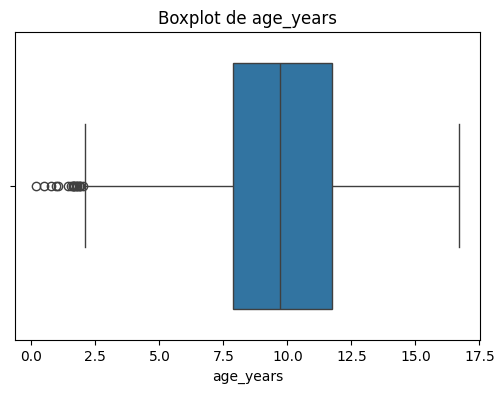
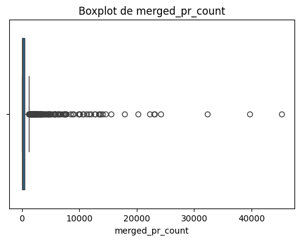
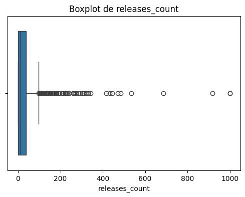
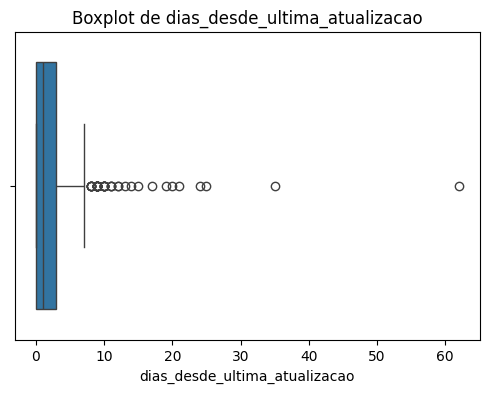
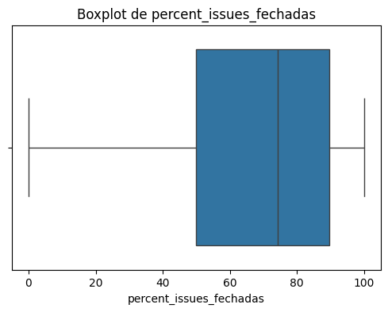
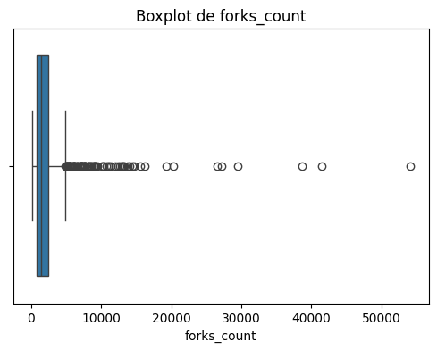
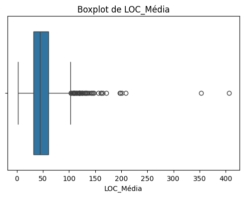
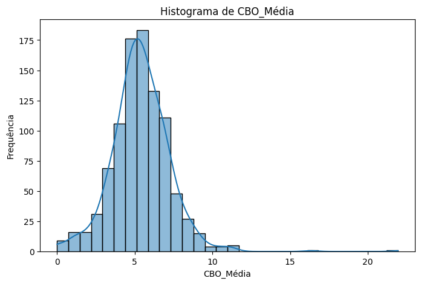
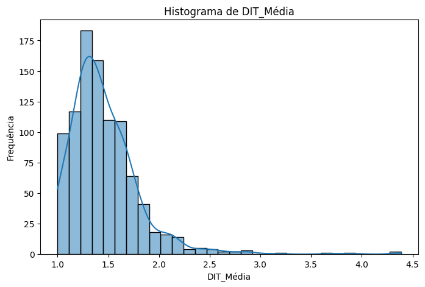
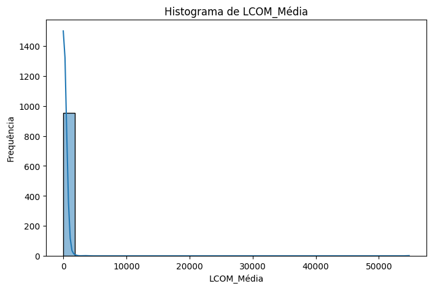

---

### 6.2. Gráficos

Para investigar as relações entre métricas de processo e métricas de qualidade, foram gerados gráficos de dispersão e heatmaps de correlação (Pearson e Spearman).

#### RQ 01. Qual a relação entre a popularidade dos repositórios e as suas características de qualidade?

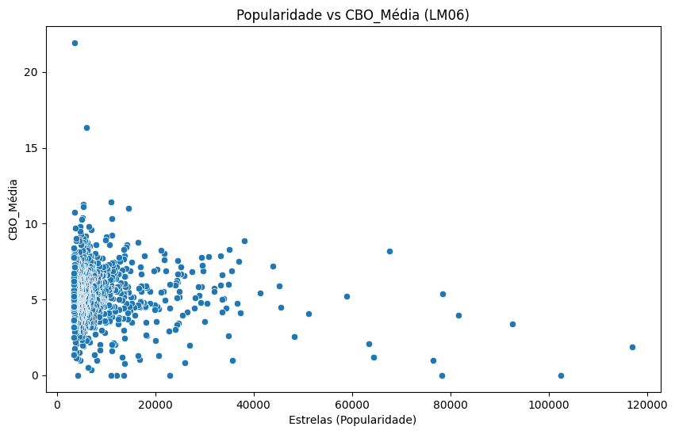
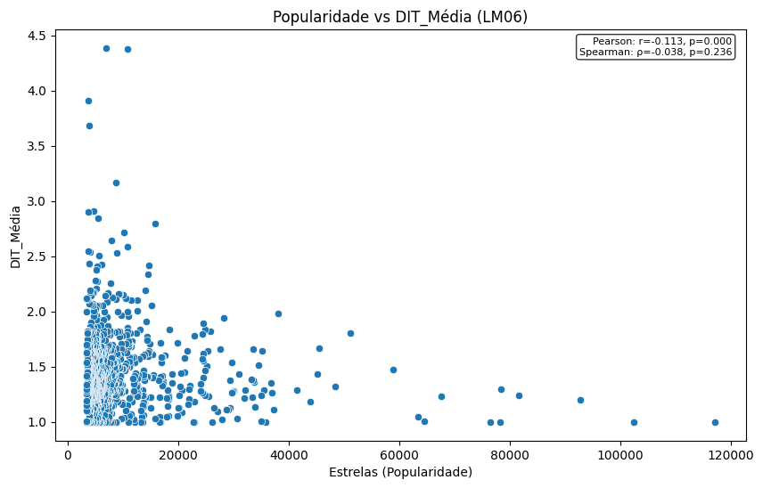
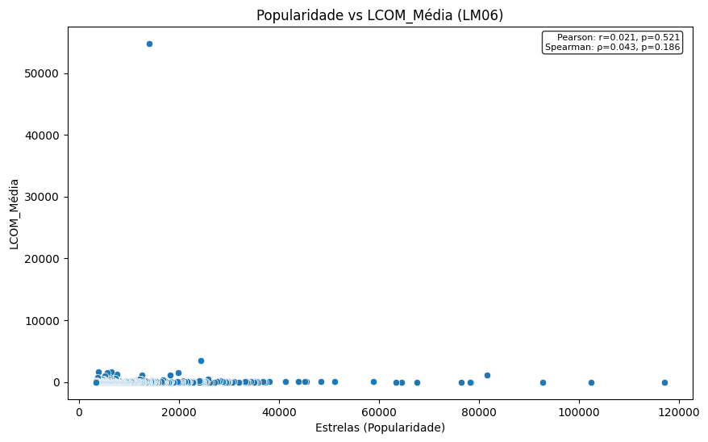

#### RQ 02. Qual a relação entre a maturidade do repositórios e as suas características de qualidade ?

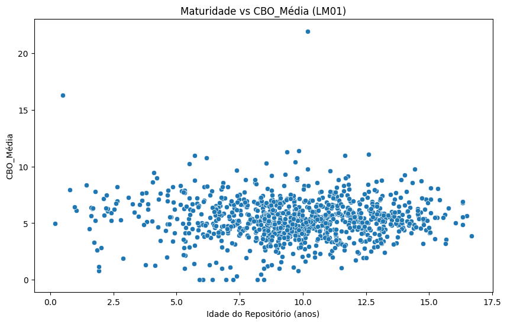
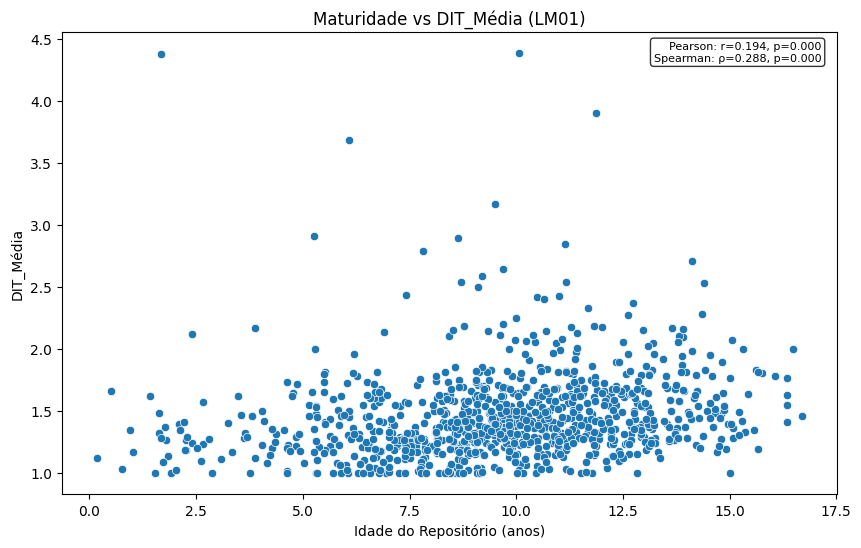
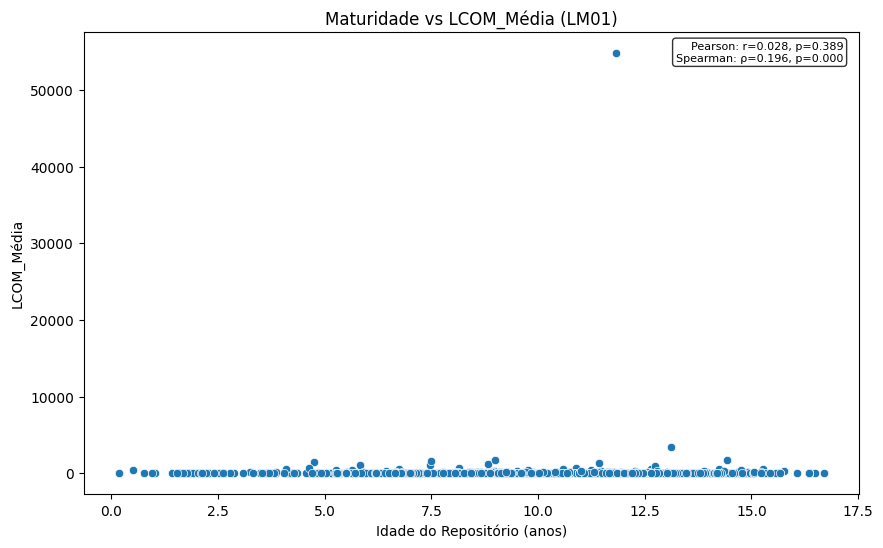

#### RQ 03. Qual a relação entre a atividade dos repositórios e as suas características de qualidade?

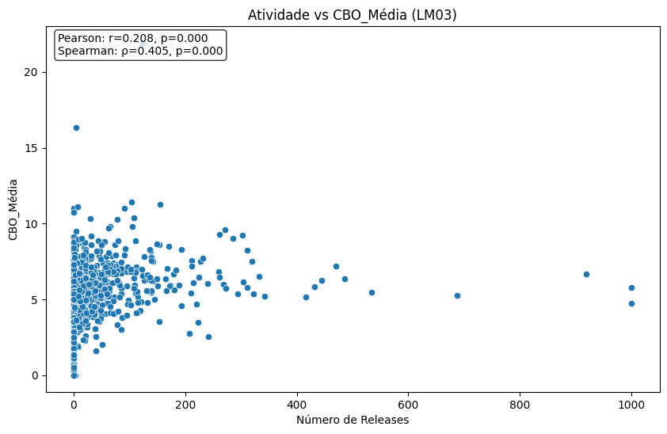
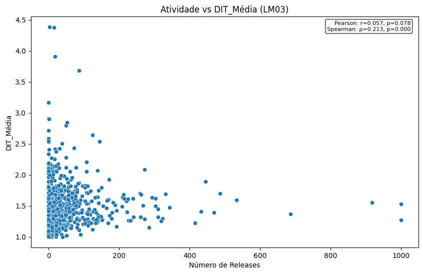
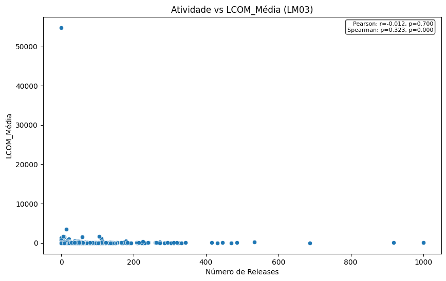

#### RQ 04. Qual a relação entre o tamanho dos repositórios e as suas características de qualidade?

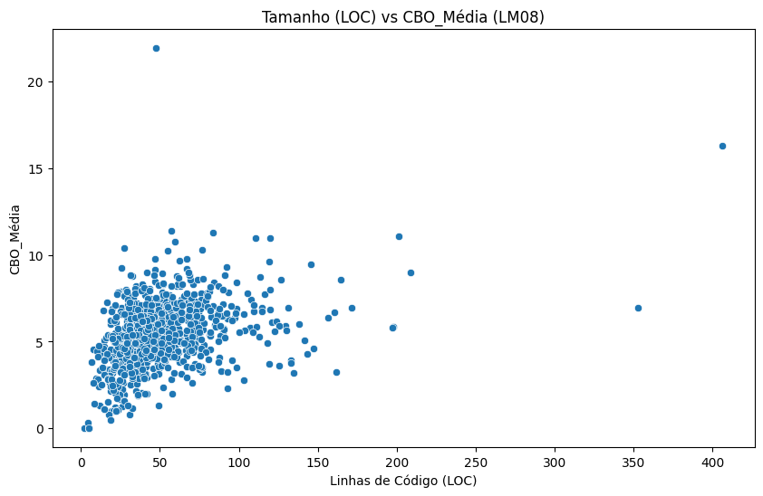
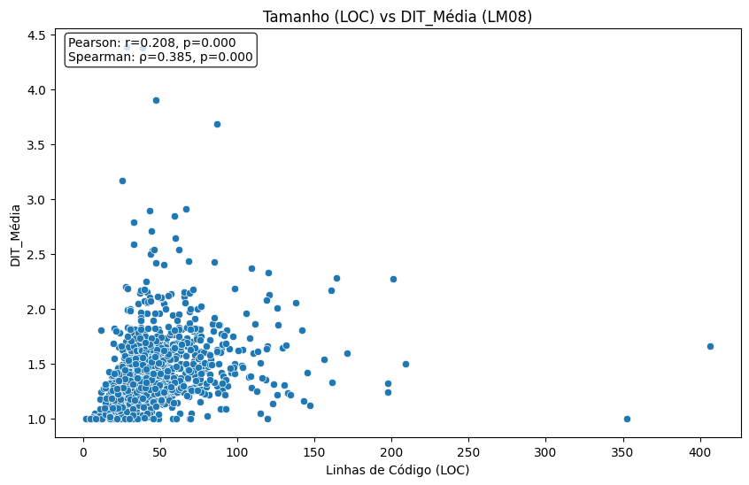
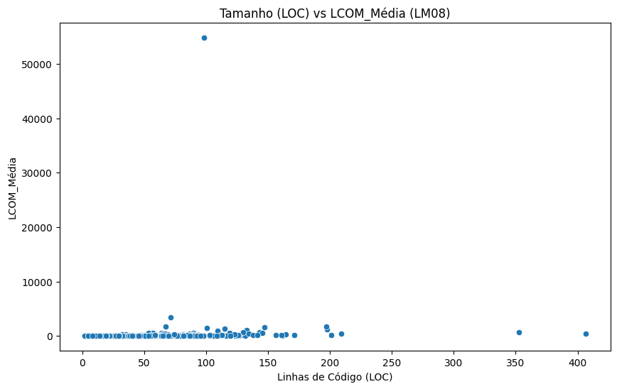
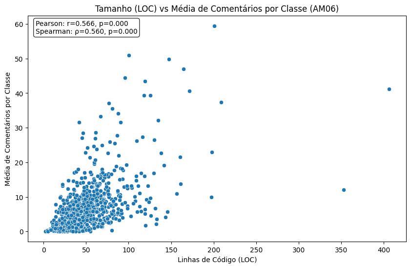
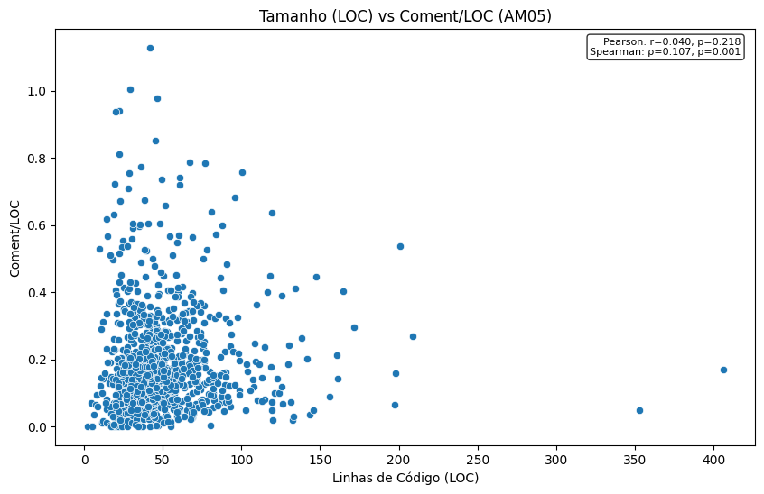

#### Correlação entre métricas

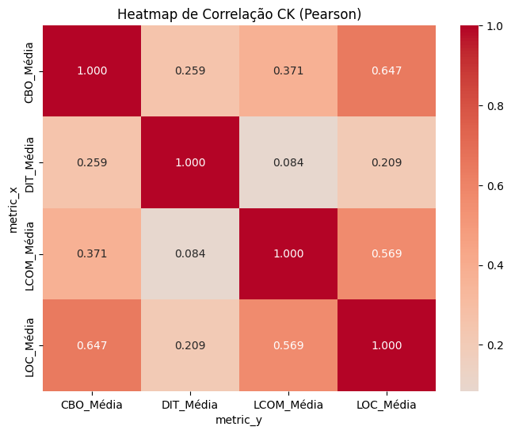
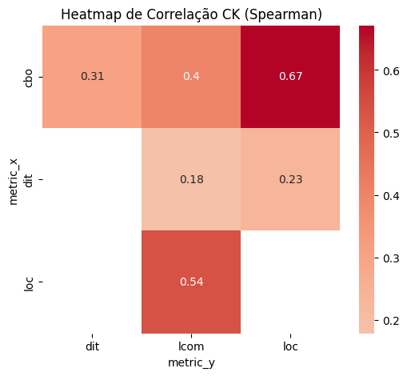

---

### 6.3. Discussão dos resultados

- **Popularidade vs Qualidade:** O número de estrelas apresenta correlação moderada com métricas como CBO e LCOM, sugerindo que projetos populares podem ter maior modularidade ou coesão.
- **Maturidade vs Qualidade:** A idade dos repositórios mostrou correlação fraca com as métricas de qualidade, indicando que projetos mais antigos não necessariamente apresentam melhor qualidade interna.
- **Atividade vs Qualidade:** O número de releases está positivamente correlacionado com algumas métricas de qualidade, sugerindo que projetos mais ativos tendem a manter melhores práticas de desenvolvimento.
- **Tamanho vs Qualidade:** O tamanho do repositório (LOC e comentários) apresenta correlação variável com as métricas de qualidade, destacando que projetos maiores podem enfrentar desafios adicionais de modularidade e coesão.

Os heatmaps de correlação sintetizam essas relações, permitindo visualizar rapidamente os pares de métricas com maior ou menor associação.

Os resultados obtidos confirmam parcialmente as hipóteses informais levantadas pelo grupo. Projetos populares e ativos tendem a apresentar melhores métricas de modularidade e coesão, enquanto a maturidade (idade) não se mostrou um fator determinante para a qualidade interna. O tamanho do repositório, por sua vez, exige atenção especial, pois pode impactar negativamente algumas métricas de qualidade.

Além disso, os gráficos de correlação evidenciaram que não existe uma relação única entre todas as métricas, reforçando a importância de analisar múltiplos aspectos simultaneamente para obter uma visão abrangente da qualidade dos sistemas Java.

---

## 7. Conclusão

O estudo permitiu analisar de forma sistemática a relação entre **métricas de processo** e **métricas de qualidade interna** em repositórios Java, utilizando a **GitHub API** e a ferramenta **CK Metrics Extractor**.

- **🏆 Principais insights:**

  - Projetos mais **populares** (maior número de estrelas e forks) mostraram correlação positiva com métricas de modularidade e coesão, confirmando parcialmente a hipótese de que maior visibilidade pode atrair boas práticas de desenvolvimento.
  - A **maturidade** (idade) dos repositórios apresentou pouca influência direta sobre a qualidade do código, contrariando a expectativa inicial de que o tempo levaria a melhorias consistentes.
  - A **atividade** (número de releases) esteve associada a métricas de manutenibilidade mais favoráveis, indicando que repositórios com ciclos de entrega mais frequentes tendem a cuidar melhor de sua estrutura interna.
  - O **tamanho** (LOC) revelou ser um fator crítico: repositórios grandes enfrentam desafios adicionais de modularidade e coesão, confirmando a hipótese de que a escala pode comprometer a simplicidade.

- **⚖️ Confronto entre Hipóteses Informais (IH) e Resultados:**

| Hipótese | Expectativa                                                               | Resultado Observado                                                                |
| -------- | ------------------------------------------------------------------------- | ---------------------------------------------------------------------------------- |
| IH01     | Repositórios mais populares teriam melhor legibilidade e modularidade.    | **Parcialmente confirmada** → popularidade correlaciona com modularidade/cohesão.  |
| IH02     | Projetos maduros manteriam métricas de qualidade mais consistentes.       | **Refutada** → idade não mostrou impacto significativo na qualidade.               |
| IH03     | Repositórios com maior atividade apresentariam maior manutenibilidade.    | **Confirmada** → releases frequentes associadas a melhores práticas de manutenção. |
| IH04     | Repositórios maiores apresentariam desafios de manutenção e modularidade. | **Confirmada** → maior LOC correlaciona negativamente com simplicidade e coesão.   |

- **⚠️ Problemas e dificuldades enfrentadas:**

  - Limites de requisições e paginação da API do GitHub, exigindo implementação de estratégias de retry e backoff exponencial.
  - Variações e inconsistências nos repositórios, como ausência de releases ou métricas incompletas em alguns CSVs da CK Tool.
  - Necessidade de normalização extensiva para padronizar dados temporais, tamanhos e métricas extraídas.
  - Tempo elevado de processamento, principalmente durante a execução da CK Tool em repositórios grandes.

- **🚀 Sugestões para trabalhos futuros:**
  - Ampliar o conjunto de métricas, incluindo indicadores de qualidade externa (ex.: bugs reportados, tempo de resolução de issues).
  - Explorar análises temporais para observar a evolução das métricas ao longo do ciclo de vida dos projetos.
  - Comparar os resultados obtidos em **Java** com repositórios de outras linguagens, avaliando diferenças no perfil de qualidade.
  - Implementar dashboards interativos que integrem métricas de processo e qualidade, facilitando análises exploratórias.
  - Investigar relações entre métricas de rede social (ex.: número de contribuidores, interações em issues/PRs) e qualidade interna do código.

---

## 8. Referências

As seguintes fontes foram utilizadas como base para fundamentação teórica, coleta e análise dos dados:

- [📌 GitHub API Documentation – GraphQL](https://docs.github.com/en/graphql)
- [📌 GitHub API Documentation – REST](https://docs.github.com/en/rest)
- [📌 CK Metrics Tool (Chidamber & Kemerer Java Metrics)](https://ckjm.github.io/)
- [📌 Biblioteca Pandas](https://pandas.pydata.org/)
- [📌 Matplotlib Documentation](https://matplotlib.org/stable/)
- [📌 Seaborn Documentation](https://seaborn.pydata.org/)
- [📌 GitPython](https://gitpython.readthedocs.io/en/stable/)
- [📌 Maven Build Tool](https://maven.apache.org/)
- [📌 Python Official Documentation](https://docs.python.org/3/)

---

## 9. Apêndices

Os apêndices reúnem materiais de apoio e complementares ao experimento:

- 💾 **Scripts desenvolvidos** para coleta, extração e análise das métricas (ex.: `collector.py`, `ck_metrics.py`, `analyzer.py`, `metrics.py`).
- 🔗 **Consultas GraphQL** e endpoints REST utilizados na extração de dados do GitHub.
- 📊 **Planilhas e arquivos CSV** gerados durante a coleta e sumarização (ex.: `top_java_repos.csv`, métricas da CK Tool).
- 📈 **Gráficos e visualizações adicionais**, não incluídos no corpo principal, mas relevantes para análises exploratórias.
- 📝 **Logs de execução e relatórios intermediários**, úteis para reprodutibilidade e rastreabilidade dos experimentos.

---
